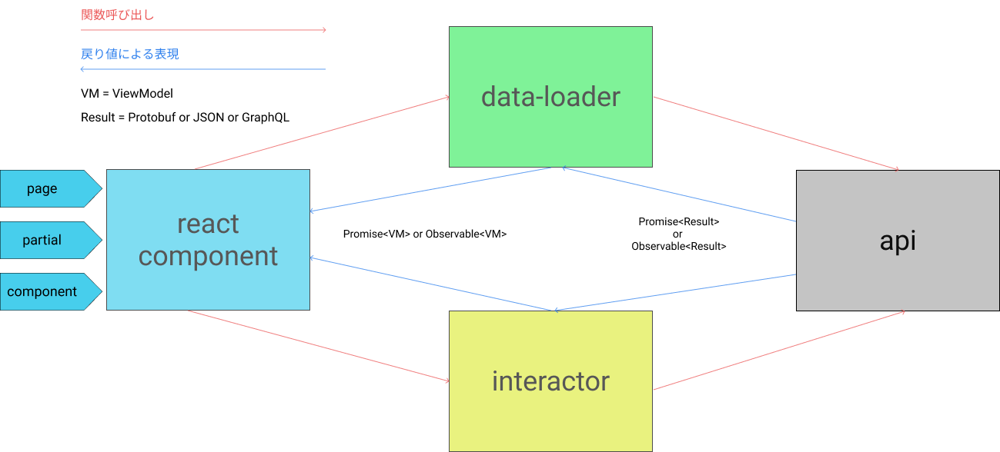

## todo-mvc

### アーキテクチャ

画像に登場した概念の説明は次の通りです。

#### view-model
#### react-component

viewです。次の項目に関心があります

- 実際にDOMにどうやって反映されるのか
- ユーザーの入力やボタンのクリックを検知して、interactorを起動し、UI stateに書き込む

また、react-componentという概念だけで運用すると、コードサイズが安定しないので次の枠組での分離があります。

##### page

partialとcomponentを組み合わせて、一枚の画面を作ります

react-routerが存在する場合は、react-routerのroute定義からのみ参照されますが、他のコンポーネントから参照することは原則禁止です

##### partial

pageでもcomponentでもない物を配置します。pageを実装していて、「実装が肥大化してきたな」とおもったら速攻でpartialに分離してください

##### component

一番小さいReactComponentの単位です。Button や ParagraphなどUIを構成する部品の中で最小の単位の物を配置します。

性質上 react-component内の区分ではどこからでも参照され得ます

atomic designでは atoms と呼ばれている物です

#### data-loader

「ページを開いた時に必要な情報を取ってくる」といった、ユーザーがページ内の要素に触ることなく発生するような処理を記述します。

APIクライアントを叩き、view-modelに変換してコンポーネントに返します。

#### interactor

「ユーザーがボタンをクリックした」や「ユーザーがテキストを入力した」といったユーザーがおこしたアクションに起因して発生する事象を記述します。
事象によってUIのstateに書き込みたい場合はPromiseやObservableでラップして、ReactComponent側でsetStateしてください

#### api

バックエンドと通信するAPIクライアント
